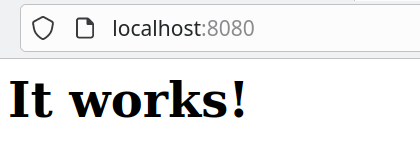

<a id='main'></a>
# Fonctionnement de base de Docker
[Retour à la page principale](../index.md)

Dans cette section, nous allons nous familiariser avec le fonctionnement de base de docker et apprendre comment nous pouvons interagir avec les différentes images et conteneurs via la ligne de commande. La syntaxe de base d'une commande commence toujours par ```docker``` et est suivie de la commande que nous voulons utiliser :

```shell
$ docker <commande> <options | parametres>
```
## 1. Résumé des commandes de base pour les conteneurs

Vous trouverez ci-dessous un résumé de certaines commandes. Pour plus d'informations vous pouvez visiter la page : [docker cheatsheet](https://dockerlabs.collabnix.com/docker/cheatsheet/)

```shell
$ docker info
$ docker version
$ docker run <image> // on crée un conteneur à partir d une image. Si nous n avons pas l image localement, elle est téléchargé automatiquement
$ docker run -d -p 82:80 nginx // Créer un conteneur en mode détaché accessible depuis le port 82
$ docker stop|start <id> // Arrêter|Lancer un conteneur
$ docker ps -a // Liste des conteneurs (-a affiche également les conteneurs arrêtés)
$ docker ps -q // Liste des identifiants de conteneur
$ docker stop $(docker ps -q) // Cela arrête tous les conteneurs renvoyés par la sous-commande `docker ps -q`
$ docker rm <id> // Supprimer un conteneur s il est arrêté
$ docker rm -f <id> // Forcer la suppression d un conteneur même s il n est pas arrêté
$ docker exec -it <id> bash // Ouvrir un terminal interactive (-it) dans le conteneur
$ docker exec <id> ls // Cela exécute la commande ls sur le conteneur pour afficher ses fichiers
$ docker cp <id>:<fichier> . // Cela copie le fichier <fichier> du conteneur dans notre système de fichiers local
```

<div id="tip">
<p>Le résumé ci-dessus est pour référence. Pour le moment, vous n'avez pas besoin de comprendre la signification de ces commandes. Nous allons les travailler dans ce tutoriel.</p>
</div>

---

## 2. Premières notions de docker

Pour vérifier que docker est installé sur votre machine (ou sur une machine de l'IUT) nous pouvons écrire la commande :

```shell
$ docker --version
```
Cela devrait montrer la version actuellement installée du moteur docker. Par exemple :

```shell
Docker version 20.10.7, build f0df350
```
L'objectif de docker est de développer, déployer et exécuter des applications dans un environnement isolé appelé **conteneur**. Procédons au lancement de notre premier conteneur en utilisant l'image ```hello-world```. Tapez :

```shell
$ docker run hello-world
```

cela devrait montrer le message :

```shell
Unable to find image 'hello-world:latest' locally
latest: Pulling from library/hello-world
2db29710123e: Pull complete 
Digest: sha256:10d7d58d5ebd2a652f4d93fdd86da8f265f5318c6a73cc5b6a9798ff6d2b2e67
Status: Downloaded newer image for hello-world:latest

Hello from Docker!
This message shows that your installation appears to be working correctly.

To generate this message, Docker took the following steps:
 1. The Docker client contacted the Docker daemon.
 2. The Docker daemon pulled the "hello-world" image from the Docker Hub.
    (amd64)
 3. The Docker daemon created a new container from that image which runs the
    executable that produces the output you are currently reading.
 4. The Docker daemon streamed that output to the Docker client, which sent it
    to your terminal.
....

```
**Vous venez de lancer votre premier conteneur Docker !!**


<div id="homework">
	<p>
	Cette image <code>hello-world</code> est conçue pour le premier contact avec Docker. Le 		résultat d'exécution est extrêmement simple : il affiche la phrase de 		
	bienvenue <b>"Hello from Docker !"</b>. Cependant, l'affichage montre aussi d'autres
	choses : l'image <code> hello-world</code> est destinée à montrer les étapes suivis du lancement de la commande 		à l'affichage des résultats. 
	</p>

	<p>
	<b>Traduire et comprendre la séquence d'événements (de 1 à 4) montré après l'exécution du conteneur.</b>
	</p>
</div>

### 2.1. Image Docker vs conteneur Docker

- Une **image Docker** est un fichier immuable (non modifiable) qui contient le code source, les bibliothèques, les dépendances, les outils et d'autres fichiers nécessaires à l'exécution d'une application. Étant donné que les images ne sont, en quelque sorte, que des modèles, vous ne pouvez pas les démarrer ou les exécuter. Ce que vous pouvez faire, c'est utiliser ce modèle comme base pour créer un conteneur. 

- Un **conteneur Docker** n'est finalement qu'une image en cours d'exécution. Une fois que vous avez créé un conteneur, il ajoute une couche inscriptible au-dessus de l'image immuable, ce qui signifie que vous pouvez maintenant le modifier.

 
- Pour voir la **liste des conteneurs** actifs en cours d'exécution sur votre machine (ou di-docker), tapez :
 
```
$ docker ps
```

- Pour voir **toutes les conteneurs**, actifs ou arrêtés, sur votre machine (ou di-docker), tapez :

```
$ docker ps -a
```

- Pour voir **toutes les images** que vous avez téléchargées sur votre machine (ou di-docker), tapez :

```
$ docker images
```

<div id="attention">
	<p>
	Les images Docker occupent une certaine quantité d'espace sur votre disque dur. Normalement, ce n'est pas un problème si vous travaillez sur votre machine personelle. Cependant, il est possible de les supprimer.
	</p>
	
	<p style="font-size:22px"> <b>Attention !! Dans le cas où vous travaillez sur les machines de l'IUT, n'exécutez pas ces commandes : elles supprimeraient tous les conteneurs et les images de vos collègues ainsi que les vôtres.</b>
	</p>

	<b style="font-size:22px">1. Arrêter tous les conteneurs en cours d'exécution</b>
	<p><code>
		docker stop $(docker ps -qa)
	</code></p>

	<b style="font-size:22px">2. Supprimer tous les conteneurs</b>
	<p><code>
		docker rm $(docker ps -qa)
	</code></p>

	<b style="font-size:22px">3. Suppression de toutes les images Docker</b>
	<p><code>
		docker rmi $(docker images -q)
	</code></p>
</div>

### 2.2. Images les plus populaires

- Sur [https://hub.docker.com/explore/](https://hub.docker.com/explore/) vous trouverez les images les plus populaires dans docker.

- Par la suite, nous utiliserons certaines de ces images, telles que ```alpine``` ou ```httpd```.

[Haut de la page](#main)

---

## 3. Interactions avec les conteneurs docker

Pour apprendre de nouvelles notions de docker dans cette section, nous allons utiliser l'image ```alpine``` et puis l'image ```httpd```. La première image (```alpine```) est  une version allégée de linux qui occupe à peine quelques mégaoctets de stockage. La deuxième image (```httpd```) est une image linux avec un serveur apache déjà configuré et prêt à être utilisé . Vous pouvez trouver [l'image d'alpine](https://hub.docker.com/_/alpine) et [l'image httpd](https://hub.docker.com/_/httpd) sur [hub.docker.com](https://hub.docker.com).

<div id="tip">
Lorsque nous exécutons la commande <code>docker run &lt;image&gt;</code>,  un conteneur sera créé à partir de celle-ci si l'image est sur notre machine. Cependant, si nous n'avons pas l'image sur notre machine, la commande  recherchera l'image sur docker hub et la téléchargera. Ce téléchargement, qui se fait automatiquement, peut aussi se faire manuellement avec <code> docker pull &lt;image&gt;</code>
</div>

### 3.1. Conteneur en mode interactif

Vous avez déjà appris qu'un conteneur est lancé avec la commande ```docker run <image>```. Pour lancer alpine, le nom de l'image est ```alpine``` et donc la commande sera ```docker run alpine```. Cependant, ce que nous n'avons pas vu, c'est qu'une image a une action à exécuter par défaut. Dans le cas d'alpine, il s'agit de la commande _"/bin/sh"_. Donc, si vous exécutez ```docker run alpine``` alpine exécutera "/bin/sh" qui ne produit aucune sortie visible. Cette commande par défaut peut être modifiée si nous passons un nouveau paramètre dans l'appel. Par exemple, faisons un ```ls``` pour lister les fichiers pour la distribution alpine :


```shell
$ docker run alpine ls
```

Bien que cela nous permette d'interagir avec le conteneur dans une certaine mesure, en principe nous ne pouvons pas faire grand-chose avec ce changement de commande. Si on veut vraiment interagir avec ce conteneur, il est préférable de passer en mode interactif. Ceci est réalisé avec l'option _-it_. 

- Tapez :

```shell
$ docker run -it alpine 
```
- Comme vous pouvez le voir, vous naviguez à l'intérieur du conteneur qui est une instance de l'image alpine. Vérifiez-le avec :

```shell
cat /etc/os-release
```
- Sans quitter le conteneur, ouvrez une autre console dans votre système d'exploitation. Nous allons maintenant montrer comment vous pouvez continuer à interagir avec le conteneur depuis autre terminal. Dans la nouvelle console, afficher tous les conteneurs actifs :

```shell
$ docker ps 
CONTAINER ID   IMAGE     COMMAND     CREATED          STATUS          PORTS     NAMES
cef06e55c9af   alpine    "/bin/sh"   26 minutes ago   Up 26 minutes             modest_maxwell
```

- Sous **CONTAINER ID**, nous pouvons voir le code de hachage du conteneur alpine. De plus, sous **NAMES**, nous pouvons voir un nom généré pour le conteneur. En utilisant l'un des deux, écrivez dans la console ouverte la commande suivante :

```shell
$ docker exec -it <HACHAGE ou NOM DU CONTENEUR> /bin/sh
```

- Cette commande ```docker exec``` nous permet d'interagir avec un conteneur déjà ouvert. Dans ce cas, nous avons lancé un terminal shell _/bin/sh_ en mode interactif _-it_. Ce mode d'interaction sera utile plus tard.

- Finalement, quitter le conteneur avec la commande _exit_


[Haut de la page](#main)

---


### 3.2. Ports, volumes et copie de fichiers

Un conteneur est un processus isolé. Cela signifie que ce qui se passe dans l'environnement virtuel du conteneur n'est pas accessible depuis la machine hôte. En soi un conteneur n'aurait pas beaucoup d'intérêt s'il est complètement isolé. Ainsi, il est possible d'exposer certaines parties du conteneur à la machine hôte. Dans cette section, nous verrons comment exposer des ports, comment copier des fichiers de la machine hôte vers le conteneur et comment partager des volumes (répertoires) entre la machine hôte et le conteneur. Pour cela nous utiliserons l'image ```httpd``` qui fournie le service **HTTP apache**.

#### 3.2.1. Ports

- Ouvrez un navigateur Web et entrez ```<machine>:<port>``` où ```<port>``` fait référence au port désigné pour l'hôte et ```<machine>``` fait référence à la machine sur laquelle vous exécutez le conteneur : ```localhost``` si vous êtes sur votre machine personelle et ```di-docker``` si vous êtes sur une machine de l'IUT. Si vous avez suivi les étapes correctement, votre navigateur devrait afficher la page Web suivante :



<b>Félicitations : vous venez d'installer votre premier service réseau avec docker !!</b>


#### 3.2.2. Volumes

<a id='section323'></a>
#### 3.2.3. Copier des fichiers dans un conteneur en cours d'exécution


<div id="homework">
<ul>
<li>Lancez un conteneur <code>httpd</code> que vous nommerez <b>httpd-&lt;votre nom&gt;</b> (c.a.d. ajoutez l'option <code>--name httpd-&lt;votre nom&gt; </code> à la commande <code>docker run</code>). N'oubliez pas de mapper le port 80 du conteneur vers un port de l'hôte.</li>

<li>Entrez le nom et le port de la machine (e.g. <code>localhost:8080</code>) dans le navigateur et vérifiez que cela fonctionne (le navigateur affiche : <b>It works!</b>).</li>

<li>Nous pouvons convenir qu'un service Web qui affiche simplement une triste page Web avec <b>"It works!"</b> n'est pas très encourageant. Cet exercice consiste à modifier, avec le conteneur en cours d'exécution, la page index.html avec un fichier de notre choix. Par exemple :</li>
</ul>
<center>
<textarea rows="6" cols="36" name="text" placeholder="Enter text">
&lt;html&gt; 
   &lt;body&gt; 
       &lt;h1&gt; index.html modifié &lt;/h1&gt;
   &lt;/body&gt; 
&lt;/html&gt; 
</textarea><br />
</center>

<ul>
<li> Trouvez la procédure pour copier ce fichier index.html de votre ordinateur hôte vers le conteneur, afin que le navigateur affiche le fichier index.html et non le message <b>It works!</b>. Faites-le avec le conteneur en cours d'exécution.</li>
</ul>

<center>
<a href="/introduction-docker/1base/solutionSection323.html"><strong>Afficher la solution à l’exercice!!</strong></a>

</center>
</div>


[Haut de la page](#main)

---


<style type="text/css" media="screen">
   #tip {
      min-height: 100px;
      background-image: url(../images/tip.png);
      background-repeat: no-repeat;
      background-position: left ;
      margin-bottom: 10px;
      padding-left:100px;
      padding-top:5px;
     color: #000000;
     font-size: 18px !important;
     border-color: #FFFFFF; !important;
     background-color: rgba(84,174,255,0.1); !important;
     border-radius: 4px !important;
     border: 1px solid #000000; !important;
   }
   
      #homework {
      min-height: 100px;
      background-image: url(../images/homework.png);
      background-repeat: no-repeat;
      background-position: left ;
      margin-bottom: 10px;
      padding-left:100px;
      padding-top:5px;
     color: #000000;
     font-size: 18px !important;
     border-color: #FFFFFF; !important;
     background-color: rgba(0,255,0,0.1); !important;
     border-radius: 4px !important;
     border: 1px solid #000000; !important;
   }
   
    #attention {
      min-height: 100px;
      background-image: url(../images/attention.png);
      background-repeat: no-repeat;
      background-position: left ;
      margin-bottom: 10px;
      padding-left:100px;
      padding-top:5px;
     color: #000000;
     font-size: 18px !important;
     border-color: #FFFFFF; !important;
     background-color: rgba(255,0,0,0.1); !important;
     border-radius: 4px !important;
     border: 1px solid #000000; !important;
   }

</style>
